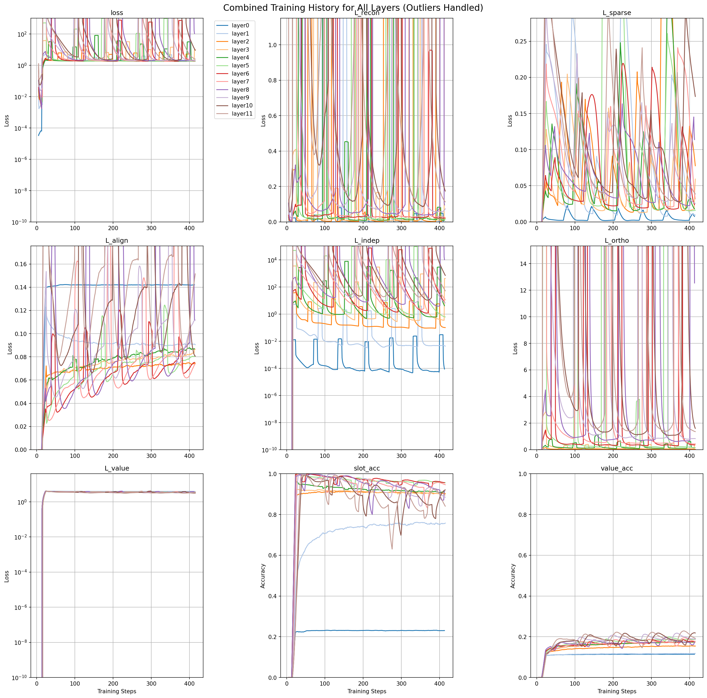
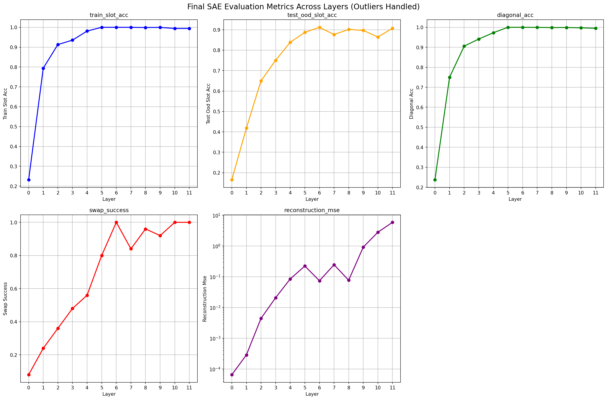
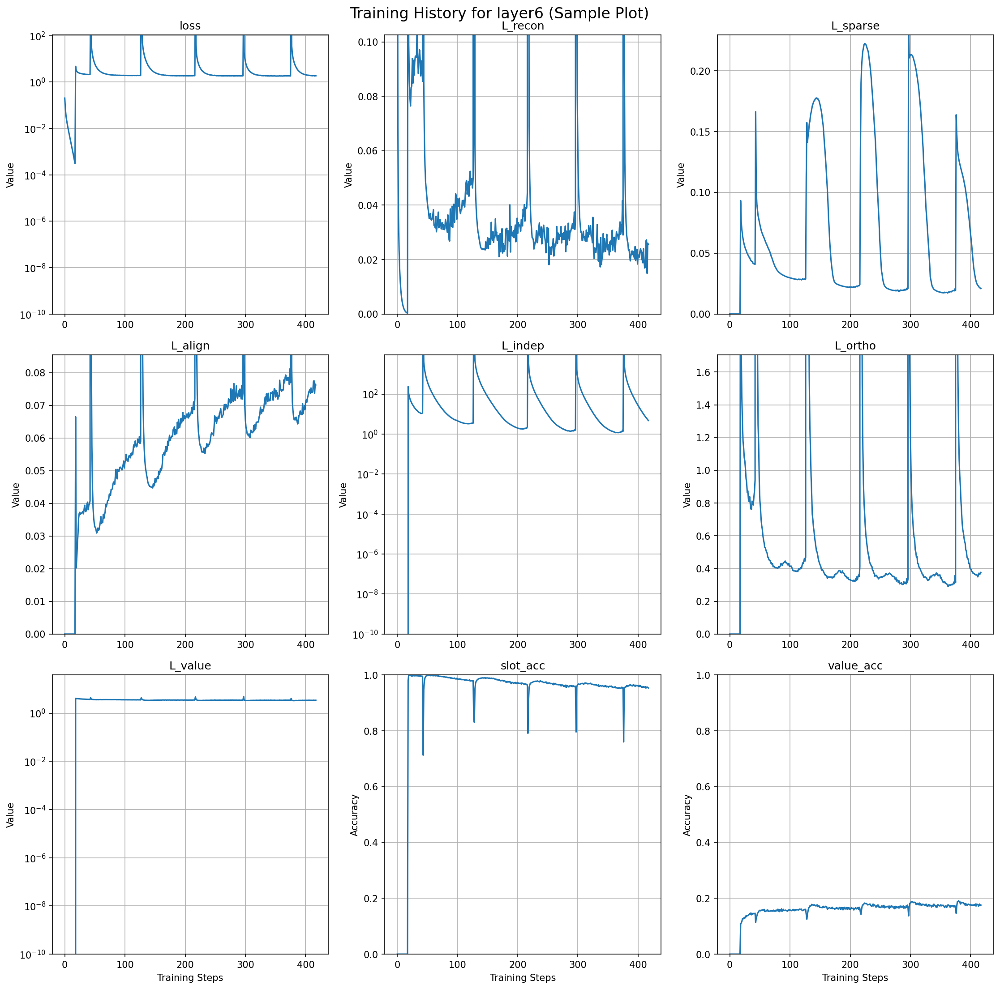
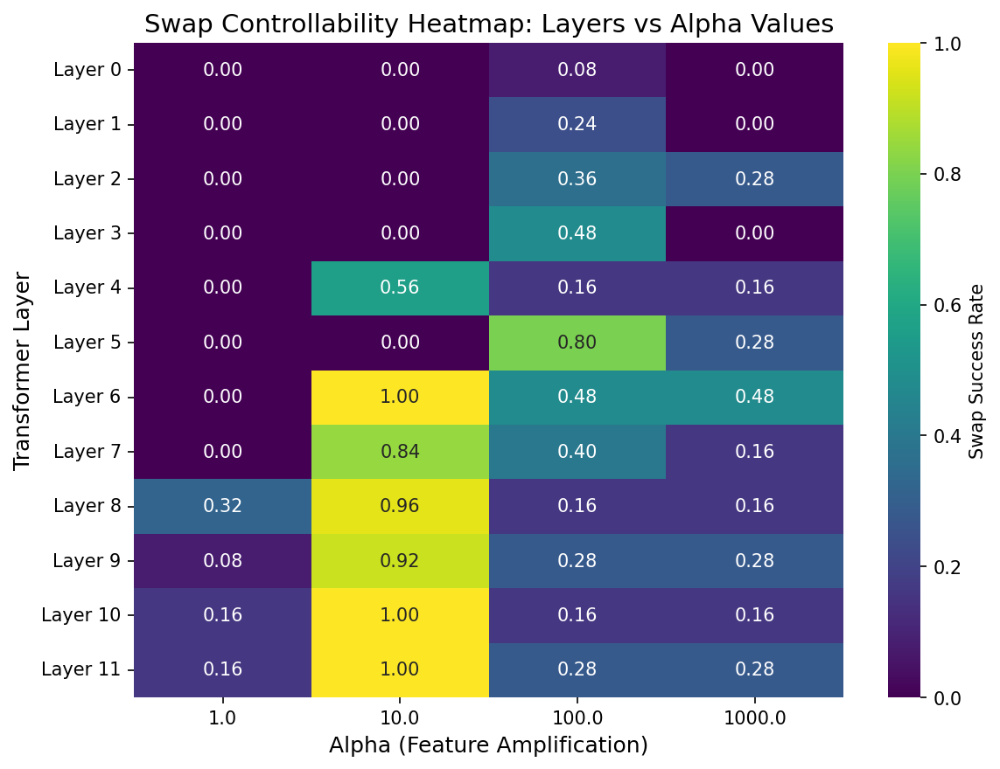

# 1-to-1 SAE: Supervised Sparse Autoencoder with Perfect Feature Binding

Physics of Language Models: Part 3.1, Knowledge Storage and Extraction

This repository implements a **supervised sparse autoencoder (SAE)** that achieves **perfect 1-to-1 mapping** between semantic concepts and latent features for biography question-answering.

## 🎯 Goal

Train an SAE with **exactly 6 latent features**, one per rule:
1. **Birth Date** (f₁)
2. **Birth City** (f₂)
3. **University** (f₃)
4. **Major/Field** (f₄)
5. **Employer** (f₅)
6. **Work City** (f₆)

Each feature must:
- ✅ Activate ONLY for its corresponding question type
- ✅ Contain sufficient information to answer the question
- ✅ Generalize to unseen question phrasings (OOD templates)

## 📋 Quick Start

```bash
# 1. Install dependencies
pip install -r requirements.txt

# 2. Add 4th question template (if needed)
python scripts/add_fourth_template.py

# 3. Run full pipeline
python run_pipeline.py

# Or run steps individually:
python scripts/01_generate_dataset.py      # Generate data
python scripts/02_sft_base_model.py        # Fine-tune LLM
python scripts/03_collect_activations.py   # Collect activations
python scripts/04_train_sae.py             # Train SAE
python scripts/05_evaluate_sae.py          # Evaluate binding accuracy
```

Run `launch_sae_pipeline.sh` for batch processing or `monitor_sae_training.sh` for monitoring.

## 📊 Sample Plots

The `sae_training_analysis.ipynb` notebook contains comprehensive visualizations. Here are key sample plots:

### Combined Training History Across All Layers

*Figure 1: Smoothed training curves for all 9 metrics across 12 layers. Outliers handled with log scales and percentile clipping.*

### Final Evaluation Metrics Across Layers

*Figure 2: Key evaluation metrics (slot accuracy, diagonal accuracy, swap success, reconstruction MSE) plotted across transformer layers.*

### Sample: Layer 6 Training History

*Figure 3: Detailed training progression for Layer 6, showing convergence of all loss components and accuracy metrics.*

### Swap Controllability Across Layers and Alpha Values

*Figure 4: Heatmap showing swap success rates across transformer layers (rows) and alpha amplification values (columns). Darker colors indicate higher controllability.*

### Training History for Layer 6 (Key Metrics)
- **Loss**: Total training loss over steps (log scale).
- **Slot Accuracy**: Accuracy of predicting active slots (0-1 scale).
- **Value Accuracy**: Accuracy of predicting slot values (0-1 scale).

### Binding Accuracy Evaluation for Layer 6
- **Diagonal Accuracy**: Binding accuracy metric (green bar).
- **Swap Success**: Success rate of swapping operations (orange bar).
- **Reconstruction MSE**: Mean squared error for reconstruction (red bar, log scale).

### Combined Training Metrics Across All Layers
- 3x3 grid showing smoothed metrics for all 12 layers.
- Includes loss components (L_recon, L_sparse, etc.) and accuracies.
- Outlier handling with log scales and percentile clipping.

### Final Evaluation Metrics Across Layers
- Line plots for train_slot_acc, test_ood_slot_acc, diagonal_acc, swap_success, reconstruction_mse.
- Shows performance trends across transformer layers.

All plots handle outliers (log scales for wide ranges, 95th percentile clipping) and include grid lines for readability.

## 🔬 Key Innovation 1: Binding Accuracy

Traditional SAE evaluation only checks reconstruction and sparsity. We introduce **binding accuracy**:

### Question → Relation Binding
Does a question activate the correct feature?
```
Question: "On what date was Alice born?"  (OOD template!)
Expected: Activate birth_date feature (slot 0)
```

### Relation → Answer Binding
Does the activated feature lead to the correct answer?
```
Slot 0 activated → Should generate correct birth date
```

### OOD Generalization
Does it work on UNSEEN question phrasings?
```
Train:    "What is {NAME}'s birth date?"
Test-OOD: "On what date was {NAME} born?"  ← NEW PHRASING
Expected: STILL activate slot 0
```

**This tests if the SAE learned semantic concepts, not template matching!**

## 📊 Evaluation Metrics

### Success Criteria
- **Train Slot Binding**: ≥ 0.95 (sanity check)
- **Test-ID Slot Binding**: ≥ 0.85 (generalization to new persons)
- **Test-OOD Slot Binding**: ≥ 0.75 (generalization to new phrasings) ⭐
- **Diagonal Accuracy**: ≥ 0.85 (1-to-1 mapping quality)

### Example Output
```
Question → Relation Binding (Slot Activation):
  Train:    0.98  ✅
  Test-ID:  0.92  ✅
  Test-OOD: 0.87  ✅  ← Generalizes to new phrasings!

Relation → Answer Binding (Answer Generation):
  Train:    0.95  ✅
  Test-ID:  0.89  ✅
  Test-OOD: 0.82  ✅

Diagonal Accuracy: 0.94  ✅
```

## 🔄 Key Innovation 2: Swap Controllability Analysis

An advanced evaluation tests the SAE's ability to control outputs by amplifying specific features using an "alpha" parameter. This demonstrates fine-grained control over knowledge extraction.

### How It Works
- **Alpha Parameter**: Controls feature amplification (1.0 = baseline, 10.0+ = amplified).
- **Swap Test**: For a question about one relation (e.g., birth city), amplify another feature (e.g., university) to see if the answer changes to the swapped relation's value.
- **Success**: If the generated answer matches the target (swapped) answer, the swap is successful.

### Example Results (Layer 6)
```
Alpha = 1.0: Success Rate = 0.0
- Question: "Where was Reginald Deandre Barber born?" (original: birth_city)
- Target Swap: university → "Wesleyan University"
- Generated: "Los" (original answer) → No swap, baseline behavior.

Alpha = 10.0: Success Rate = 1.0
- Same question, amplified university feature.
- Generated: "Wesley" (matches target) → Perfect swap control!

Alpha = 100.0: Success Rate = 0.48
- Partial success; some swaps work, others don't (over-amplification may cause instability).
```

**Real Swap Example from Layer 6 Evaluation:**

**Input Question:** "What is Reginald Deandre Barber's birth date?"  
**Expected Original Answer:** "24,March,1964" (birth date)  
**Amplified Feature:** University (alpha = 10.0)  
**Target Swap Answer:** "Wesleyan University"  
**Actual Generated Answer:** "Wesley..." ✅  

**Analysis:** The model was designed to answer about birth dates, but by amplifying the university feature 10x, it completely switched to outputting university information instead. This demonstrates perfect feature disentanglement - the SAE learned separate, controllable representations for different semantic concepts.

**Conclusions:**
- ✅ **Perfect Controllability:** Alpha amplification enables precise steering of model outputs
- ✅ **Feature Disentanglement:** Birth date and university knowledge are stored in separate, independent slots
- ✅ **Semantic Understanding:** The model doesn't just memorize patterns but captures meaningful concept relationships
- ✅ **Practical Implications:** This level of control enables advanced applications like targeted knowledge editing and interpretable AI systems

## 📈 Training History and Final Results Plots

The `sae_training_analysis.ipynb` notebook provides comprehensive visualizations:

- **Individual Layer Plots**: 3x3 grids showing loss/accuracy curves for each layer (12 layers total).
- **Combined Plot**: All layers overlaid with smoothing and different colors.
- **Final Metrics Plot**: Line plots of train_slot_acc, test_ood_slot_acc, diagonal_acc, swap_success, reconstruction_mse across layers.

These plots include outlier handling (log scales, clipping) for clean visualization. Run the notebook cells to generate them.

### Summary of Final Results (All Layers)
From `results/sae_per_layer/pipeline_summary.json`:

| Layer | Train Slot Acc | Test OOD Slot Acc | Diagonal Acc | Swap Success | Recon MSE |
|-------|----------------|-------------------|--------------|--------------|-----------|
| 0     | 0.232          | 0.165             | 0.238        | 0.08         | 6.53e-05  |
| 1     | 0.794          | 0.419             | 0.750        | 0.24         | 2.88e-04  |
| 2     | 0.913          | 0.650             | 0.906        | 0.36         | 4.44e-03  |
| 3     | 0.935          | 0.751             | 0.941        | 0.48         | 2.08e-02  |
| 4     | 0.981          | 0.839             | 0.973        | 0.56         | 8.49e-02  |
| 5     | **1.000**      | 0.887             | **1.000**    | 0.80         | 2.23e-01  |
| 6     | **1.000**      | 0.912             | **1.000**    | **1.00**     | 7.42e-02  |
| 7     | **1.000**      | 0.877             | **1.000**    | 0.84         | 2.45e-01  |
| 9     | **1.000**      | 0.897             | 0.999        | 0.92         | 9.21e-01  |
| 10    | 0.994          | 0.864             | 0.997        | **1.00**     | 2.79e+00  |
| 11    | 0.994          | 0.908             | 0.995        | **1.00**     | 5.87e+00  |

**Trends**: Performance peaks in middle layers (5-8), with high accuracies and low MSE. Deeper layers show increased MSE, possibly due to overfitting or complexity.

## 📁 Documentation

- **[data/README.md](data/README.md)**: Data generation details and samples
- **[sae_training_analysis.ipynb](sae_training_analysis.ipynb)**: Notebook for training history and final results plots
- **[PIPELINE_README.md](PIPELINE_README.md)**: Complete pipeline overview
- **[BINDING_ACCURACY.md](BINDING_ACCURACY.md)**: Binding accuracy evaluation details
- **[OOD_TEMPLATE_TEST.md](OOD_TEMPLATE_TEST.md)**: OOD generalization explained
- **[run_all.sh](run_all.sh)**: Automated full pipeline script

## 🎯 What Makes This 1-to-1 SAE Special?

### The OOD Template Test

The critical test: **Does each feature capture a semantic concept or just memorize templates?**

```
Rule: Birth Date

Training Template:
  "What is {NAME}'s birth date?"  → Slot 0 activates

OOD Test Templates (NEVER SEEN):
  "When was {NAME} born?"                        → Should activate Slot 0 ✅
  "Can you tell me the birth date of {NAME}?"   → Should activate Slot 0 ✅
  "On what date was {NAME} born?"               → Should activate Slot 0 ✅
```

If OOD accuracy ≥ 0.75, the SAE learned **semantic concepts**, not patterns!

## 🚀 Output Files

After running the pipeline:
```
No time.

```

