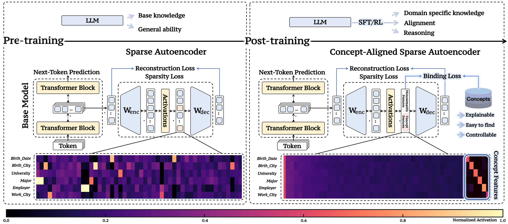

# AlignSAE: Concept-Aligned Sparse Autoencoders

<p align="center">
<a href="#overview">[Overview]</a>
<a href="#quick-start">[Quick Start]</a>
<a href="#key-findings">[Key Findings]</a>
<a href="#citation">[Citation]</a>
</p>
<hr>

## Overview

AlignSAE is a framework that upgrades Sparse Autoencoders (SAEs) from descriptive probes to operational interfaces for controlling Large Language Models (LLMs). By aligning SAE features with a predefined ontology through a "pre-train, then post-train" curriculum, AlignSAE enables precise causal interventions and mechanistic analysis of LLM representations.

**Key Innovation:** Unlike unsupervised SAEs that spread concepts across multiple entangled features, AlignSAE dedicates one slot per concept, making features easy to find, interpret, and steer. This allows reliable "concept swaps" and step-wise binding in multi-hop reasoning.


<br><sub>An overview of our approach. Left: An unsupervised SAE trained post hoc on frozen LLM activations optimizes only reconstruction and sparsity, so each concept tends to be spread across multiple features, making interventions unreliable. Right: Our Concept-Aligned SAE adds a supervised binding loss that maps each concept to a dedicated feature, yielding clean, isolated activations that are easy to find, interpret, and steer.</sub>

**What you get**
- 1-hop (bio QA) pipeline with concept-aligned slots (BIRTH_DATE, BIRTH_CITY, UNIVERSITY, MAJOR, EMPLOYER, WORK_CITY).
- 2-hop reasoning extension with step-wise slot binding and swap interventions.
- Ready-to-run scripts for data gen, training, SAE, evaluation, and swaps.

## Quick Start

```bash
# Install dependencies
pip install -r requirements.txt

# 1-Hop (Bio QA) Pipeline
python 1hop/scripts/01_generate_dataset.py      # Generate data
python 1hop/scripts/02_sft_base_model.py        # Fine-tune base model
python 1hop/scripts/03_collect_activations.py   # Collect activations
python 1hop/scripts/04_train_sae.py             # Train supervised SAE
python 1hop/scripts/05_evaluate_sae.py          # Evaluate & swap
python 1hop/scripts/06_swap_evaluate.py         # Swap evaluation

# 2-Hop (Relations) Pipeline
# Generate two-hop QA
python 2hop/_gen_data/generate_two_hop.py --path 2hop/_dataset/_org/train.jsonl
python 2hop/_gen_data/generate_two_hop.py --path 2hop/_dataset/_org/val.jsonl
# Optional downsample
python 2hop/split_dataset.py
# Train 2-hop model
bash 2hop/run_train_two_hop.sh
# Full SAE pipeline (activations → SAE → eval → swap → grokking)
bash 2hop/run_full_pipeline.sh
# Swap interventions
bash 2hop/run_swap_layer6.sh
```

Details: see `RUN.md` (top-level) and `2hop/README.md`.

## Key Findings

- **Perfect Concept Binding:** At layer 6, AlignSAE achieves 100% diagonal accuracy, meaning each concept maps to exactly one slot with no entanglement.
- **Reliable Causal Control:** Swap interventions succeed 85% of the time at optimal amplification (α=2), enabling precise steering of model outputs.
- **4x Better Swaps in 2-Hop:** Supervised AlignSAE attains 4x higher swap success than traditional unsupervised SAEs in multi-hop reasoning.
- **Mechanistic Grokking Insights:** AlignSAE reveals how generalization emerges in compositional tasks, with diffuse evidence consolidating into stable step-wise bindings.
- **Layer-Wise Emergence:** Concept alignment improves dramatically from early layers (24% binding) to mid layers (100% at layer 6), with +81% swap success gain.

These results demonstrate AlignSAE's ability to turn opaque LLM representations into verifiable, controllable interfaces, advancing mechanistic interpretability toward practical intervention.

## Key Metrics

### Swap Controllability
Tests the SAE's ability to control outputs by amplifying specific features:
- Amplify feature B when asking about attribute A
- Success if model outputs attribute B's value instead

### Binding Accuracy
Measures one-to-one concept-slot alignment, invariant to permutations.

## Results

**Key Finding (Bio QA):** Semantic concept binding emerges in middle transformer layers (5–8). Layer 6 achieves perfect binding accuracy and strong swap controllability.

**2-Hop Reasoning:** Swapping relation slots shows supervised SAEs outperform unsupervised baselines.

## Citation

If you use this code or find our work helpful, please cite:

```
[PLACEHOLDER]
```


