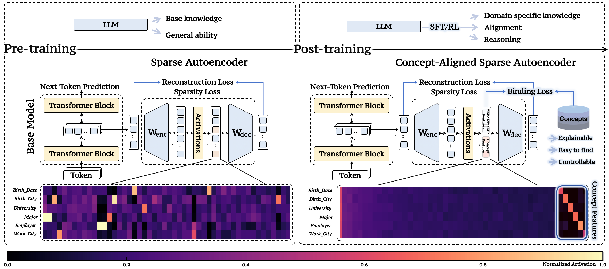

<div align="center">

# AlignSAE: Concept-Aligned Sparse Autoencoders

<!-- Badges -->
[](https://openreview.net/forum?id=I9UjKxW4nq)
[](https://arxiv.org/abs/2512.02004)
[](https://ymingl.com/alignsae-site/)
[](https://ymingl.com/assets/pdf/AlignSAEslides.pdf)
[](LICENSE)
[](https://www.python.org/)

_Turning Sparse Autoencoders from **descriptive probes** into **controllable interfaces** for LLMs._

<a href="#-overview">Overview</a> •
<a href="#-key-findings">Key Findings</a> •
<a href="#-installation">Installation</a> •
<a href="#-quick-start">Quick Start</a> •
<a href="#-repository-structure">Structure</a> •
<a href="#-citation">Citation</a>

</div>

<p align="center">
  
</p>
<p align="center"><sub><b>Left:</b> an unsupervised SAE trained post hoc on frozen LLM activations optimizes only reconstruction and sparsity, so each concept is spread across many entangled features — making interventions unreliable. <b>Right:</b> AlignSAE adds a supervised binding loss that maps each concept in a predefined ontology to a <i>dedicated</i> feature, yielding clean, isolated activations that are easy to find, interpret, and steer.</sub></p>

---

## 📌 Overview

**AlignSAE** upgrades Sparse Autoencoders (SAEs) from descriptive probes into *operational interfaces* for controlling Large Language Models. By aligning SAE features with a predefined ontology through a **"pre-train, then post-train"** curriculum, AlignSAE enables precise causal interventions and mechanistic analysis of LLM representations.

**Key idea.** Unlike unsupervised SAEs that scatter a concept across multiple entangled features, AlignSAE dedicates **one slot per concept**, so features become easy to find, interpret, and steer. This yields reliable *concept swaps* in 1-hop factual recall and *step-wise binding* in multi-hop reasoning.

**What's in this repo**
- 🧩 **1-hop (bio QA)** pipeline with concept-aligned slots — `BIRTH_DATE`, `BIRTH_CITY`, `UNIVERSITY`, `MAJOR`, `EMPLOYER`, `WORK_CITY`.
- 🔗 **2-hop reasoning** extension with step-wise slot binding, swap interventions, and grokking analysis.
- 🛠️ **End-to-end scripts** for data generation, base-model fine-tuning, activation collection, SAE training, evaluation, and steering.

## 🔑 Key Findings

| Finding | Result |
| --- | --- |
| **Perfect concept binding** (layer 6) | 100% diagonal accuracy — each concept maps to exactly one slot |
| **Reliable causal control** | 85% swap success at moderate amplification ($\alpha\approx2$) |
| **Multi-hop steering** | 4× higher swap success than unsupervised SAEs in 2-hop reasoning |
| **Layer-wise emergence** | Binding rises from 24% (early layers) to 100% (layer 6); +81% swap-success gain |
| **Mechanistic grokking** | Diffuse evidence consolidates into stable step-wise bindings as generalization emerges |

## ⚙️ Installation

```bash
git clone https://github.com/yminglai/AlignSAE.git
cd AlignSAE
pip install -r requirements.txt
```

Requires Python 3.10+ and PyTorch 2.0+ (GPU recommended for training).

## 🚀 Quick Start

### 1-Hop (Bio QA)

```bash
python 1hop/scripts/01_generate_dataset.py      # Generate synthetic bio QA data
python 1hop/scripts/02_sft_base_model.py        # Fine-tune the base LLM
python 1hop/scripts/03_collect_activations.py   # Collect layer activations
python 1hop/scripts/04_train_sae.py             # Train the concept-aligned SAE
python 1hop/scripts/05_evaluate_sae.py          # Evaluate binding
python 1hop/scripts/06_swap_evaluate.py         # Swap-controllability evaluation
# Or run the whole thing:
bash 1hop/scripts/run_all_onehop.sh
```

### 2-Hop (Compositional Reasoning)

```bash
# Generate two-hop QA
python 2hop/_gen_data/generate_two_hop.py --path 2hop/_dataset/_org/train.jsonl
python 2hop/_gen_data/generate_two_hop.py --path 2hop/_dataset/_org/val.jsonl
python 2hop/split_dataset.py                     # (optional) downsample
bash 2hop/run_train_two_hop.sh                   # Train the 2-hop model
bash 2hop/run_full_pipeline.sh                   # Activations → SAE → eval → swap → grokking
bash 2hop/run_swap_layer6.sh                     # Swap interventions at layer 6
```

📖 Full details: [`RUN.md`](RUN.md) and [`2hop/README.md`](2hop/README.md).

## 📁 Repository Structure

```
AlignSAE/
├── 1hop/                     # 1-hop factual-recall (bio QA) pipeline
│   ├── data/                 #   entities, QA templates, dataset generator
│   ├── scripts/              #   01_generate → 06_swap_evaluate (+ run_all)
│   └── sae_pipeline.py
├── 2hop/                     # 2-hop compositional-reasoning extension
│   ├── _gen_data/            #   two-hop QA generation
│   ├── facts_database/       #   entity relations & facts
│   ├── grok/                 #   grokking analysis outputs
│   └── 01..07_*.py           #   activations → SAE → eval → swap → grokking
├── plots/                    # Figures used in the paper/README
├── requirements.txt
├── RUN.md                    # Detailed run guide
└── README.md
```

## 🧪 Evaluation Metrics

- **Binding Accuracy** — one-to-one concept↔slot alignment via the diagonal of the relation–slot confusion matrix (permutation-invariant).
- **Swap Controllability** — amplify concept *B*'s slot while querying attribute *A*; a swap succeeds when the model outputs *B*'s value. Measures causal, not merely diagnostic, control.

## 📄 Citation

If you use this code or find our work helpful, please cite:

```bibtex
@article{yang2026alignsae,
  title={AlignSAE: Concept-Aligned Sparse Autoencoders},
  author={Minglai Yang and Xinyu Guo and Zhengliang Shi and Jinhe Bi and Steven Bethard and Mihai Surdeanu and Liangming Pan},
  journal={Transactions on Machine Learning Research},
  issn={2835-8856},
  year={2026},
  url={https://openreview.net/forum?id=I9UjKxW4nq}
}
```

## 📬 Contact

Questions or issues? Open a [GitHub issue](https://github.com/yminglai/AlignSAE/issues) or reach out to the corresponding authors: **Minglai Yang** (`mingly@arizona.edu`) and **Mihai Surdeanu** (`msurdeanu@arizona.edu`).

## 📝 License

Code released under the [MIT License](LICENSE).
